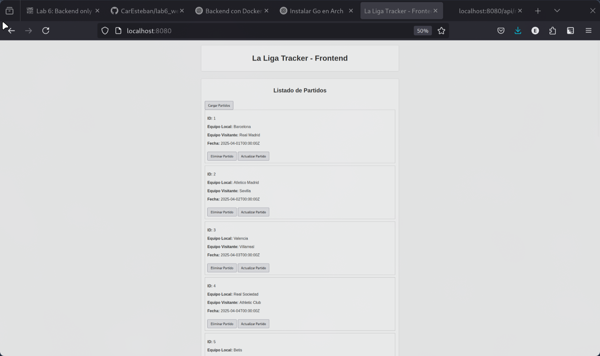
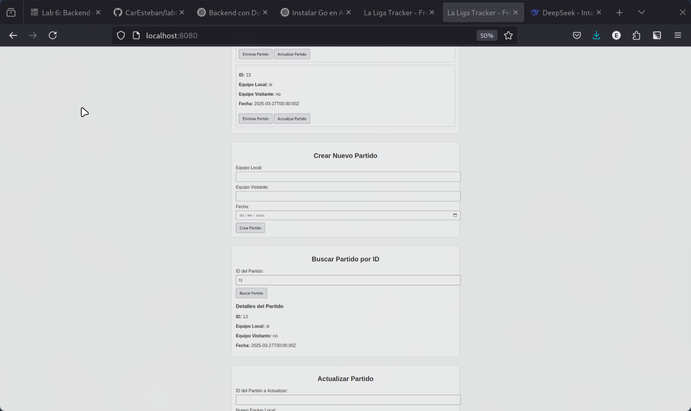
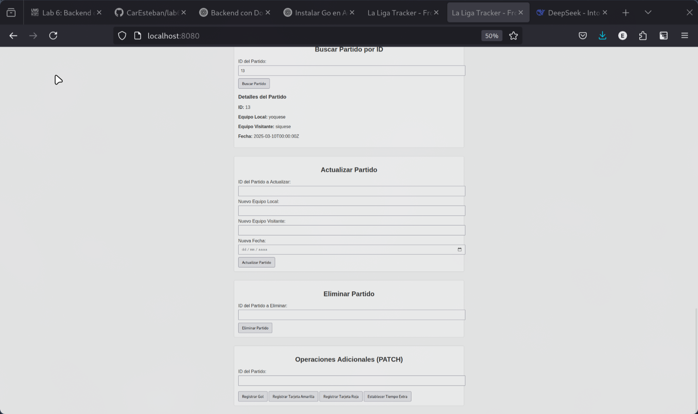

# Laboratorio 6 - Desarrollo de Backend para La Liga Tracker







## Descripción del Proyecto

Este proyecto consiste en el desarrollo de un backend en **Go (Golang)** para la aplicación web "La Liga Tracker", que permite gestionar partidos de fútbol de La Liga. El objetivo es conectar un frontend existente con una API REST, implementando operaciones CRUD y utilizando Docker para el despliegue.

## Requisitos Cumplidos

- ✅ Desarrollo de endpoints REST:  
  `GET /api/matches` | `GET /api/matches/:id` | `PUT /api/matches/:id`  
  `POST /api/matches` | `DELETE /api/matches/:id`.
- ✅ Conexión con base de datos PostgreSQL (configuración en `docker-compose.yml` e inicialización con `db/init.sql`).
- ✅ Dockerización del backend (puerto `8080`).

## Estructura del Proyecto

```bash
.
├── cmd/
│ └── main.go # Punto de entrada de la aplicación
├── db/
│ └── init.sql # Script de inicialización de la base de datos
├── internal/
│ ├── db.go # Lógica de conexión a la base de datos
│ └── models.go # Modelos de datos (structs de partidos)
├── Dockerfile # Configuración para construir la imagen Docker
├── docker-compose.yml # Orquestación de servicios (app + PostgreSQL)
├── go.mod # Dependencias de Go
├── LaligaTracker.html # Frontend proporcionado
└── README.md
```

## Instalación y Uso

### Prerrequisitos

- Docker y Docker Compose instalados.
- Go 1.20+ (solo para desarrollo local).

### Ejecución con Docker

1. Clonar el repositorio:

   ```bash
   git clone [URL_DEL_REPOSITORIO]
   cd Laboratorio
   ```

2. Construir y ejecutar la imagen Docker:

```bash
  docker-compose up --build

```

3. Acceder al frontend:

   El backend estará disponible en http://localhost:8080/api/matches.

   Tambien con el frontend en http://localhost:8080/

## Desarrollo Local (sin Docker)

1. **Iniciar la base de datos**:

```bash
docker-compose up db
```

2. Ejecutar el backend:

```bash
go run cmd/main.go
```

### Endpoints de la API

| Método     | Endpoint            | Descripción                    |
| ---------- | ------------------- | ------------------------------ |
| **GET**    | `/api/matches`      | Obtiene todos los partidos     |
| **GET**    | `/api/matches/{id}` | Obtiene un partido por ID      |
| **POST**   | `/api/matches`      | Crea un nuevo partido          |
| **PUT**    | `/api/matches/{id}` | Actualiza un partido existente |
| **DELETE** | `/api/matches/{id}` | Elimina un partido             |

## Configuración de la Base de Datos

**Motor:** PostgreSQL

**Variables de entorno** (definidas en `docker-compose.yml`):

```bash
POSTGRES_USER=postgres
POSTGRES_PASSWORD=yourpassword
POSTGRES_DB=lab6_laliga

```
